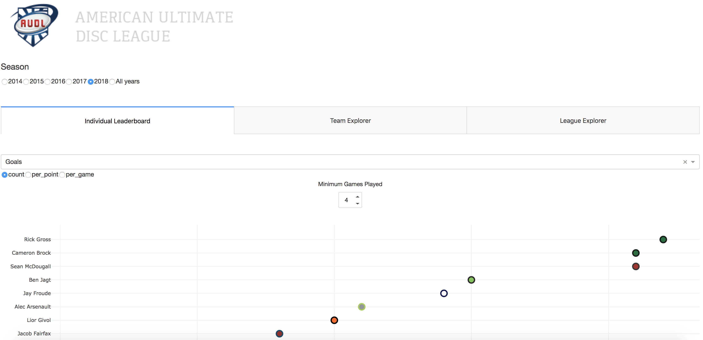

AUDL Data Visualization
==============================

Interaction visualization of data from the [American Ultimate Disc League](https://www.theaudl.com) 

**https://audl-viz.herokuapp.com/**  

Visualization built in [Dash](https://plot.ly/products/dash/) and hosted on [Heroku](https://www.heroku.com/).  
For a technical guide to Dash development, 
refer to my [Medium article](https://towardsdatascience.com/a-gentle-introduction-to-dash-development-and-deployment-f8b91990d3bd)

### Data 
Data is collected during each AUDL game using the UltiAnalytics app that then saves raw data to 
[UltiAnalytics](https://www.ultianalytics.com/index.html).  
Dan Fiorino wrote [audl-pull](https://github.com/dfiorino/audl-pull), 
a Python repo providing invaluable data cleaning and standardization.  
As of May 2019, I am working with him to refactor all stat definitions and calculations within his repo,  
so that the audl-viz repo only handles data visualization. 

